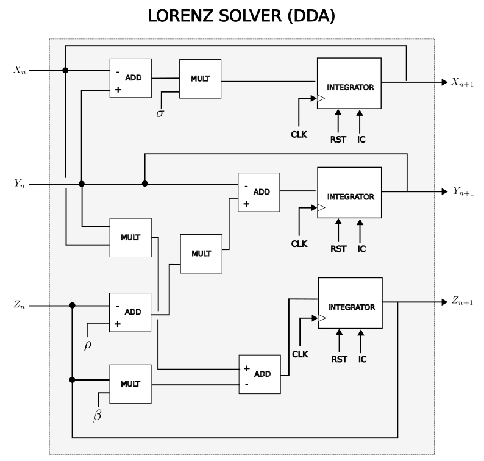

  

# DDA solver for Lorenz equations

Hardware accelerator to solve Lorenz nonlinear differential equations submitted to [TinyTapeout 6](https://tinytapeout.com). 
- [Read the technical documentation for this project](docs/info.md)

## What is a DDA solver?

A Digital Differential Analyzer (DDA) is a digital circuit that use integrators to solve differential equations (DE) in digital systems. This project implements a simple Euler integration algorithm in hardware using a new floating-point numerical system called posit (see [below](#why-posit-numbers)). To program a DDA one has to wire basic components such as adders, multipliers and integrators together to express the desired set of equations, in a similar fashion as the old analog computers were programmed. 

The Lorenz equation is decribed by a set of three coupled ordinary differential equations given by,

$$
\begin{align}
\frac{dx}{dt} &= \sigma (y-x)\\
\frac{dy}{dt} &= x(\rho-z) - y\\
\frac{dz}{dt} &= xy - \beta z
\end{align}
$$

## Why posit numbers ?

Posit number is a new way to encode and operate with floating point numbers in digital systems that is gaining attention for application in AI hardware accelerators. Compared to standard IEE 754 floating-point format, posits offer a few advantages including the ability to get more precision or dynamic range out of a given number of bits allowing a hardware designer to tailor 

Dynamics range is given by $(2n-4)2^{es}\log_{10}2$

1. Add your Verilog files to the `src` folder.
2. Edit the [info.yaml](info.yaml) and update information about your project, paying special attention to the `source_files` and `top_module` properties. If you are upgrading an existing Tiny Tapeout project, check out our [online info.yaml migration tool](https://tinytapeout.github.io/tt-yaml-upgrade-tool/).
3. Edit [docs/info.md](docs/info.md) and add a description of your project.
4. Optionally, add a testbench to the `test` folder. See [test/README.md](test/README.md) for more information.

The GitHub action will automatically build the ASIC files using [OpenLane](https://www.zerotoasiccourse.com/terminology/openlane/).

## Enable GitHub actions to build the results page

- [Enabling GitHub Pages](https://tinytapeout.com/faq/#my-github-action-is-failing-on-the-pages-part)

## Resources

- [FAQ](https://tinytapeout.com/faq/)
- [Digital design lessons](https://tinytapeout.com/digital_design/)
- [Learn how semiconductors work](https://tinytapeout.com/siliwiz/)
- [Join the community](https://tinytapeout.com/discord)
- [Build your design locally](https://docs.google.com/document/d/1aUUZ1jthRpg4QURIIyzlOaPWlmQzr-jBn3wZipVUPt4)

## What next?

- [Submit your design to the next shuttle](https://app.tinytapeout.com/).
- Edit [this README](README.md) and explain your design, how it works, and how to test it.
- Share your project on your social network of choice:
  - LinkedIn [#tinytapeout](https://www.linkedin.com/search/results/content/?keywords=%23tinytapeout) [@TinyTapeout](https://www.linkedin.com/company/100708654/)
  - Mastodon [#tinytapeout](https://chaos.social/tags/tinytapeout) [@matthewvenn](https://chaos.social/@matthewvenn)
  - X (formerly Twitter) [#tinytapeout](https://twitter.com/hashtag/tinytapeout) [@matthewvenn](https://twitter.com/matthewvenn)
